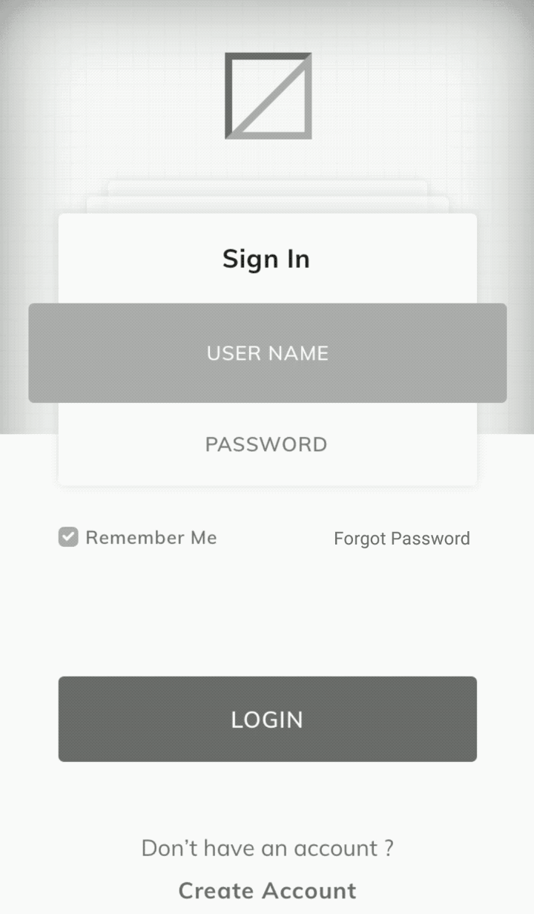

<h1>Introduction</h1>
INTUZ presents a very useful React Native component which allows you to have a popup of forgot password feature for your next mobile app projects. Try it your self by following below integration, Enjoy!

<br>
<h1>Features</h1>

- Customizable background
- Customizable your text
 

<br>


<h1>Getting Started</h1>

> Import ForgotPasswordController    in your .js file

```
import ForgotPasswordController from './app/component/ForgotPasswordController';   
```

> Render your ForgotPasswordController

```
<ForgotPasswordController 
        callbackAfterForgotPassword={(success, otherValue) => {this.setState({forgotPasswordModalVisible: false});
            console.log("success >> "+success+" otherValue >> "+otherValue);}} 
        otherParamsToSend={this.state.otherParamsToSend}/>  

```

> Put above code in <Modal> Tag in render() like below: (Note: Import Modal from react-native)

```
var forgotPasswordModel = <Modal transparent={true} visible={this.state.forgotPasswordModalVisible} onRequestClose={() => {
            this.setState({forgotPasswordModalVisible: false}); }}>
            
    <ForgotPasswordController 
        callbackAfterForgotPassword={(success, otherValue) => {this.setState({forgotPasswordModalVisible: false});
            console.log("success >> "+success+" otherValue >> "+otherValue);}} 
        otherParamsToSend={this.state.otherParamsToSend}/>        
</Modal>
```
<br>
<h1>Properties</h1>

| Available properties | Type | Default Value | Required | Description |
|--------------------------|------------------------|-------------------------------|----------|-------------------------------------------------------------------------------------------------------------------------------------------------------------------------|
| backgroundColor | String | white | No | Background color for popup |
| titleText | String  | Forgot Password | No | Title of forgot password controller |
| submitText | String | Send | No | Text for Submit button |
| placeHolderText | String | Email Address | No | Placeholder text for email |
| otherParamsToSend | - | - | No | Other parameters to send to forgot password and want it back in callback from controller |
| callbackAfterForgotPassword | Function | - | Yes | Callback function will return success and other parameters which are sent to controller |

<br>
<h1>Bugs and Feedback</h1>

For bugs, questions and discussions please use the Github Issues.

<br>
<h1>License</h1>

Copyright (c) 2018 Intuz.
<br><br>
Permission is hereby granted, free of charge, to any person obtaining a copy of this software and associated documentation files (the "Software"), to deal in the Software without restriction, including without limitation the rights to use, copy, modify, merge, publish, distribute, sublicense, and/or sell copies of the Software, and to permit persons to whom the Software is furnished to do so, subject to the following conditions:
<br><br>
THE SOFTWARE IS PROVIDED "AS IS", WITHOUT WARRANTY OF ANY KIND, EXPRESS OR IMPLIED, INCLUDING BUT NOT LIMITED TO THE WARRANTIES OF MERCHANTABILITY, FITNESS FOR A PARTICULAR PURPOSE AND NONINFRINGEMENT. IN NO EVENT SHALL THE AUTHORS OR COPYRIGHT HOLDERS BE LIABLE FOR ANY CLAIM, DAMAGES OR OTHER LIABILITY, WHETHER IN AN ACTION OF CONTRACT, TORT OR OTHERWISE, ARISING FROM, OUT OF OR IN CONNECTION WITH THE SOFTWARE OR THE USE OR OTHER DEALINGS IN THE SOFTWARE.

<h1></h1>
<a href="http://www.intuz.com">

</a>
